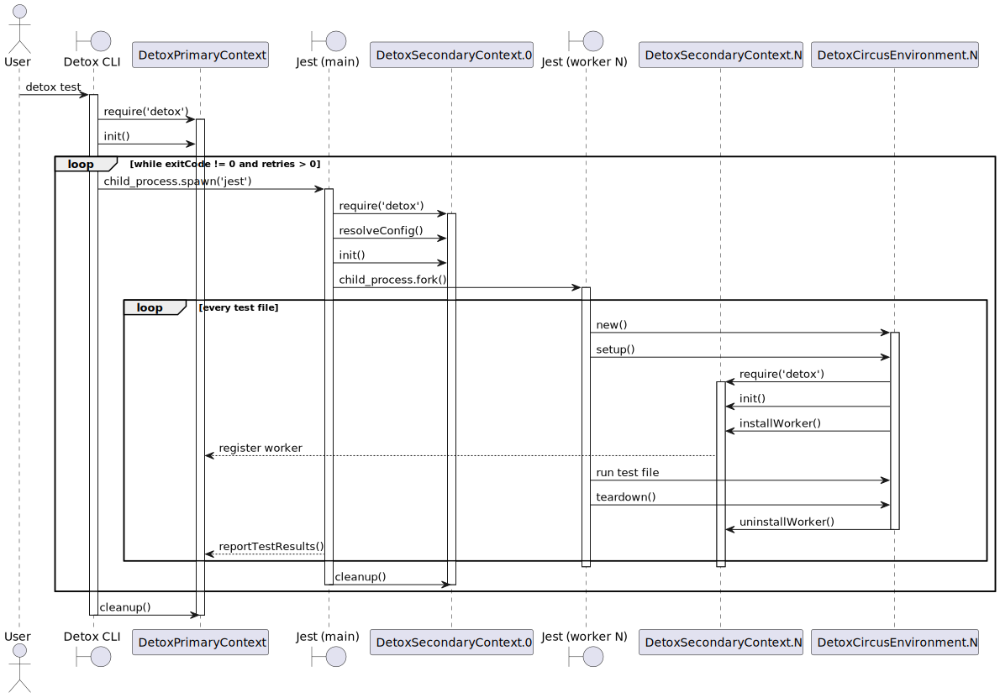

<!-- markdownlint-configure-file { "first-line-h1": 0 } -->

1. User runs Detox CLI: `detox test [...options] [...testFiles]`.

1. Detox CLI imports `detox/internals` and calls `detoxInternals.init({ workerId: null })`. This initializes the primary context of Detox test session without allocating an actual worker, e.g. iOS or Android device. We'll do it later, in the context of Jest environment.

1. Detox CLI will be running and re-running the tests until all of them pass, or it exceeds the maximal count of retries.

1. To run all or specific tests, Detox will be spawning a child process of the test runner, which is Jest in our case.

1. That's why we have to initialize one more context – a secondary Detox context – in Jest's main process as well. Moreover, it has to be accessible even not in an initialized status when resolving Jest config. For example, your Jest config might calculate the number of `maxWorkers` depending on `config.device.type`.

When `detoxInternals.init({ workerId: null })` is called again, now it creates a secondary Detox context for communication with the primary context. It will ensure that any Jest reporter can query Detox session state for such essential things as: actual count of workers, passed and failed tests from the past retries, etc. We again avoid creating a worker, because the main Jest process is an orchestrator for the child workers.

1.
